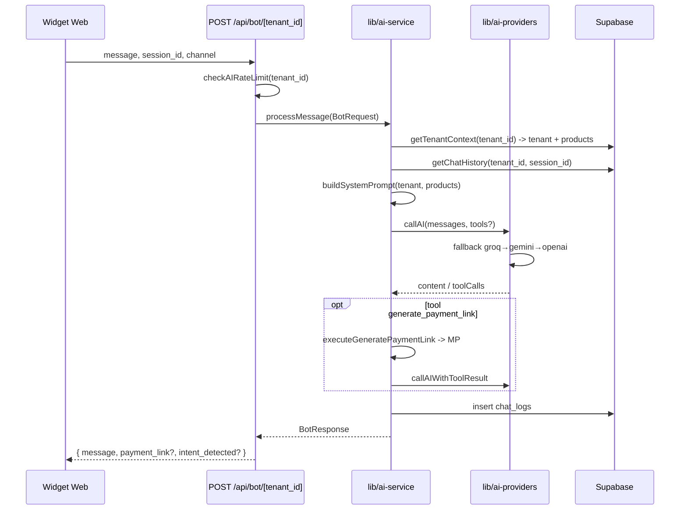

# Análisis completo y plan de acción — YD Social Ops

## Nota sobre el documento roadmap

- El archivo `**roadmap-yd-social-ops.docx**` es binario y no se puede leer desde aquí. Se usó como fuente el contenido equivalente en **[docs/SOCIAL-OPS-ROADMAP.md](docs/SOCIAL-OPS-ROADMAP.md)** (lista de ingeniería y roadmap), más **[docs/MEJORAS-CHAT.md](docs/MEJORAS-CHAT.md)**, **[docs/CONFIGURACION.md](docs/CONFIGURACION.md)** y **[docs/AI-PROVIDERS.md](docs/AI-PROVIDERS.md)**.

---

## PASO 1 — Mejoras, bugs y features documentados

### Del roadmap principal ([SOCIAL-OPS-ROADMAP.md](docs/SOCIAL-OPS-ROADMAP.md))

- **Ubicación y mapas:** mejorar manejo de ubicación (campos, validación, uso en prompt); mapas interactivos (embed Google Maps/Mapbox por `business_address`).
- **Chatbot y personalización:** personalización por `business_type`; configuraciones por rubro; **skills** por tipo (ventas, consultoría, servicios) para cerrar mejor la conversación.
- **Métricas y analítica:** productos/servicios más consultados; frecuencia por categoría/canal; interacciones relevantes (conversiones, intención de compra, links de pago); almacenamiento y visualización (tablas/vistas, dashboard o export).
- **Automatización:** integración n8n (webhooks, triggers); chatbot que ayude a configurar automatizaciones; segundo chatbot/herramienta de configuración.
- **Planes y arquitectura:** documentar qué incluye cada plan (Básico, Pro, Enterprise); plan personalizado (arquitectura propia, integraciones a medida).
- **Asignación por plan:** tabla de mejoras por plan (Básico/Pro/Enterprise/Personalizado) — referencia para documentación y límites en código.
- **Gestión:** integrar lista “Social Ops” en ClickUp (MCP o manual).

### De [MEJORAS-CHAT.md](docs/MEJORAS-CHAT.md)

- Fallback entre modelos Groq (429 → modelos alternativos).
- Historial de conversación (chat_logs por session_id).
- Campo dirección en tenant (`business_address`).
- Mejoras system prompt (contexto/ambigüedad, concisión, identidad).
- Disponibilidad por fechas (opcional).
- Consistencia datos de transferencia (bot comparte datos bancarios cuando piden “transferir”).

---

## PASO 2 — Resumen del código existente

### Flujo del chatbot

- **Widget:** [public/widget.js](public/widget.js) — GET `/api/widget/[tenant_id]` (config), POST `/api/bot/[tenant_id]` (mensaje).
- **Bot API:** [app/api/bot/[tenant_id]/route.ts](app/api/bot/[tenant_id]/route.ts) — valida, rate limit, `processMessage`, responde JSON.
- **IA:** [lib/ai-service.ts](lib/ai-service.ts) — `getTenantContext`, `buildSystemPrompt` (catálogo, tono, contacto, identidad, disponibilidad), `getChatHistory`, `callAI`/tools, `detectIntent`, guardado en `chat_logs`.

### Base de datos

- **Tipos:** [types/index.ts](types/index.ts) — `Tenant`, `Product`, `ChatLog`, `SocialChannel`, `BotRequest`, `BotResponse`, enums (PlanTier, ChatChannel, BusinessType, ContactAction, BotTone, ItemType, IntentType).
- **Schema:** [supabase/schema.sql](supabase/schema.sql) — `tenants`, `tenant_users`, `products`, `chat_logs`, `social_channels`; RLS; `get_my_tenant_id()`. El schema base no incluye columnas que el código sí usa: `business_type`, `business_description`, `contact_action`, `contact_*`, `bot_tone`; en producción probablemente existen por migraciones o ALTER previos.
- **Vista:** `v_chat_stats` referida en documentación para estadísticas por tenant/día.

### Canales

- **Webhook único Meta:** [app/api/webhooks/meta/route.ts](app/api/webhooks/meta/route.ts) — GET verificación; POST según `body.object`: `whatsapp_business_account` → WhatsApp, `page` → Messenger, `instagram` → Instagram.
- **Adaptadores:** [lib/channel-adapters/](lib/channel-adapters/) — `whatsapp`, `messenger`, `instagram`, `tiktok`, `web` (generic). Parsean payload y metadata (`phone_number_id`, `page_id`, `ig_account_id`); buscan canal en `social_channels` por `provider_config`; llaman a `processMessage` y envían respuesta con el adapter.

### Tenants

- Identificación por `tenant_id` en todas las tablas; acceso vía `get_my_tenant_id()` (usuario autenticado). El bot es público por `tenant_id`; rate limit por `tenant_id` en [lib/rate-limit.ts](lib/rate-limit.ts).

### Estructura de carpetas

- `**/api`:** webhooks (meta, saas-subscription, tiktok), auth (meta, mercadopago), bot, widget, channels/webhook.
- `**/lib`:** ai-service, ai-providers, channel-adapters, supabase (server, client, middleware), rate-limit, mercadopago, encryption, utils.
- `**/components`:** ui (shadcn), dashboard (sidebar, header, settings-client, products-client, copy-bot-url-button, csv-import-dialog, contexts).
- `**/app/(dashboard)/dashboard`:** page (estadísticas), chat-logs, channels (lista + simulator), products, settings.

---

## PASO 3 — Cruce roadmap vs código

### Ya implementado (roadmap / MEJORAS-CHAT)

| Ítem                                          | Estado en código                                                                                                                                                        |
| --------------------------------------------- | ----------------------------------------------------------------------------------------------------------------------------------------------------------------------- |
| Fallback Groq (modelos alternativos ante 429) | [lib/ai-providers.ts](lib/ai-providers.ts): `getGroqModelsToTry()` → principal + `llama-3.1-8b-instant`, `allam-2-7b`                                                   |
| Historial de conversación                     | [lib/ai-service.ts](lib/ai-service.ts): `getChatHistory()` desde `chat_logs` por `session_id`, límite `AI_CHAT_HISTORY_LIMIT`                                           |
| Campo dirección en tenant                     | `tenants.business_address` en schema y types; en prompt en `buildSystemPrompt`; en [components/dashboard/settings-client.tsx](components/dashboard/settings-client.tsx) |
| Mejoras system prompt                         | `buildSystemPrompt`: contexto/ambigüedad, concisión, identidad, disponibilidad por fechas (contactar negocio)                                                           |
| Consistencia datos transferencia              | `buildContactInstructions`: instrucciones explícitas para compartir datos bancarios cuando no hay MP                                                                    |
| Disponibilidad por fechas (opción B)          | Instrucción en prompt: contactar al negocio si preguntan fechas                                                                                                         |

### Parcialmente implementado

- **Ubicación:** Campo y uso en prompt existen; faltan validación robusta y **mapas interactivos** (roadmap).
- **Personalización por rubro:** `business_type`, tono, contacto y catálogo por tipo existen; **skills** por tipo (ventas/consultoría/servicios) y configuraciones específicas por rubro **no**.
- **Métricas:** Dashboard con total mensajes, intenciones de compra, links de pago, productos activos y logs recientes ([actions/dashboard.ts](actions/dashboard.ts)); **no** hay: productos más consultados, frecuencia por categoría/canal, export, API de analítica (roadmap Pro/Enterprise).
- **Planes:** Pricing y webhook MP existen; **no** hay documentación clara en UI de qué incluye cada plan ni **plan personalizado** ni lógica de features por plan en código.

### No implementado

- Mapas interactivos (embed por `business_address`).
- Skills orientados a cierre (ventas/consultoría/servicios).
- Métricas avanzadas (productos más consultados, por canal, reportes, export).
- Integración n8n.
- Chatbot/asistente de configuración y segundo bot de optimización.
- Plan personalizado y documentación de features por plan en app.
- Integración ClickUp.

### Posibles problemas no mencionados en el roadmap

1. **Schema desactualizado:** [supabase/schema.sql](supabase/schema.sql) no define `business_type`, `business_description`, `contact_action`, `contact_*`, `bot_tone` en `tenants`, ni `item_type` en `products`, aunque el código y [types/index.ts](types/index.ts) sí. Riesgo: nuevos entornos sin migraciones previas fallarían. **Acción:** tener migraciones o un schema.sql alineado con los tipos.
2. **Duplicidad de tipo DashboardStats:** [types/index.ts](types/index.ts) define `DashboardStats` (snake_case: total_messages, total_sessions, etc.) y [actions/dashboard.ts](actions/dashboard.ts) exporta otro `DashboardStats` (camelCase + recentLogs). La página usa el de actions. Puede generar confusión y desincronización; conviene un solo tipo (p. ej. en types) y mapeo en la action.
3. **Rendimiento dashboard:** [actions/dashboard.ts](actions/dashboard.ts) hace un `select("intent_detected, payment_link")` sobre **todos** los `chat_logs` del tenant para contar; en tenants con muchos mensajes puede ser lento. Valorar agregación (vista/materializada o COUNT en DB).
4. **Modelo Groq:** El fallback usa `allam-2-7b` (ALLaM 2 7B, árabe/inglés). Es modelo válido en Groq; para respuestas en español puede no ser óptimo; considerar otro modelo de fallback si se prioriza español.

---

## PASO 4 — Plan de acción priorizado

### Prioridad 1 — Bugs / consistencia (recomendado hacer primero)

| Tarea                       | Descripción                                                                                                                                                                              | Estimación | Archivos                                                                                                                                                 | Dependencias |
| --------------------------- | ---------------------------------------------------------------------------------------------------------------------------------------------------------------------------------------- | ---------- | -------------------------------------------------------------------------------------------------------------------------------------------------------- | ------------ |
| Alinear schema DB con tipos | Añadir columnas faltantes en `tenants` y `products` (business_type, business_description, contact_action, contact_*, bot_tone, item_type) vía migración Supabase y actualizar schema.sql | 1–2 h      | supabase (migración), [supabase/schema.sql](supabase/schema.sql)                                                                                         | Ninguna      |
| Unificar DashboardStats     | Usar un único tipo (p. ej. en types) y que la action devuelva ese formato; actualizar página si hace falta                                                                               | ~30 min    | [types/index.ts](types/index.ts), [actions/dashboard.ts](actions/dashboard.ts), [app/(dashboard)/dashboard/page.tsx](app/(dashboard)/dashboard/page.tsx) | Ninguna      |

### Prioridad 2 — Features core del roadmap

| Tarea                                    | Descripción                                                                                               | Estimación | Archivos                                                                                                                      | Dependencias                   |
| ---------------------------------------- | --------------------------------------------------------------------------------------------------------- | ---------- | ----------------------------------------------------------------------------------------------------------------------------- | ------------------------------ |
| Ubicación: validación y mejora en prompt | Validar `business_address` (trim, no solo espacios); reforzar uso en prompt si aplica                     | ~30 min    | [lib/ai-service.ts](lib/ai-service.ts), [components/dashboard/settings-client.tsx](components/dashboard/settings-client.tsx)  | Ninguna                        |
| Mapas interactivos (Pro)                 | Embed de mapa (Google Maps/Mapbox) por `business_address` o coordenadas en ficha del negocio o widget     | 2–4 h      | Componente nuevo, posiblemente settings o página pública; env para API key mapa                                               | Ubicación con dirección válida |
| Métricas básicas (Básico)                | Mejorar dashboard: total_sessions y unique_users (a partir de chat_logs) si no están; mantener bajo costo | 1–2 h      | [actions/dashboard.ts](actions/dashboard.ts), [app/(dashboard)/dashboard/page.tsx](app/(dashboard)/dashboard/page.tsx), tipos | Ninguna                        |
| Documentar planes en UI                  | Texto o sección “Qué incluye tu plan” (Básico/Pro/Enterprise) según tabla del roadmap                     | 1–2 h      | Página pricing o dashboard/settings                                                                                           | Ninguna                        |

### Prioridad 3 — Integraciones y avanzado

| Tarea                      | Descripción                                                                                            | Estimación | Archivos                                                               | Dependencias         |
| -------------------------- | ------------------------------------------------------------------------------------------------------ | ---------- | ---------------------------------------------------------------------- | -------------------- |
| Métricas clave (Pro)       | Productos más consultados (chat_logs + product_id), frecuencia por canal; vista o query agregada       | 2–3 h      | Supabase (vista/query), action, página o pestaña dashboard             | Prioridad 2 métricas |
| Skills por tipo de negocio | Lógica o “skills” en prompt por business_type (ventas vs consultoría vs servicios) para mejorar cierre | 2–4 h      | [lib/ai-service.ts](lib/ai-service.ts), posiblemente config por tenant | Ninguna              |
| n8n (Enterprise)           | Webhooks salientes o API n8n para automatizaciones; documentar y exponer endpoints                     | 4–8 h      | API routes, env, documentación                                         | Definir casos de uso |
| Plan personalizado         | Modelo/documentación y flujo (contacto o formulario) para clientes “a medida”                          | 2–4 h      | Tipos, UI pricing/contacto, doc                                        | Ninguna              |

### Roadmap desactualizado o a revisar

- **MEJORAS-CHAT.md:** Los ítems 1–6 figuran como hechos; el código los cumple. Opcional: marcar “Disponibilidad por fechas” como “Hecho (opción B)” para evitar duplicar trabajo.
- **Tabla de asignación por plan (sección 6):** Es referencia para documentación y futura lógica de features; no está implementada en código (límites por plan). Si se quieren restricciones reales (ej. solo Pro puede usar mapas), habría que añadir comprobaciones por `plan_tier` en backend y UI.
- **ClickUp (sección 7):** Depende de tener MCP/API de ClickUp configurada; es tarea de gestión, no de código, salvo script/MCP para crear tareas.

### Sugerencias no recogidas en el roadmap

1. **Optimizar estadísticas del dashboard:** No traer todas las filas de `chat_logs`; usar COUNT/agregación en Supabase o vista `v_chat_stats` ya mencionada en schema.
2. **Un solo tipo de estadísticas:** Unificar `DashboardStats` y, si se amplían métricas, centralizar en types para evitar duplicados.
3. **Health check del bot:** GET `/api/bot/[tenant_id]` ya existe; opcionalmente comprobar que el tenant existe y devolver 503 si no (hoy devuelve 200 siempre).
4. **Límites por plan en código:** Cuando se definan bien los planes, implementar comprobaciones (ej. mapas solo Pro/Enterprise, n8n solo Enterprise) para alinear producto con la tabla del roadmap.

---

## PASO 5 — Por dónde empezar (lo más crítico)

**Recomendación:** No hay un bug único que bloquee el uso del sistema. Lo más crítico desde el punto de vista de **consistencia y mantenibilidad** es:

1. **Alinear schema de base de datos con el código** (migración + schema.sql). Evita fallos en nuevos despliegues y deja una sola fuente de verdad para columnas de `tenants` y `products`.

Si prefieres **impacto visible rápido** sin tocar DB:

1. **Unificar el tipo `DashboardStats`** y, si se quiere, **mejorar el cálculo de estadísticas** (agregación en DB en lugar de cargar todos los logs).

**Implementación sugerida para lo “más crítico”:**  
Empezar por la **migración de Supabase** que añada las columnas faltantes a `tenants` y `products`, y actualizar [supabase/schema.sql](supabase/schema.sql) para que refleje el estado real (y futuro) del esquema. Así cualquier otro cambio (validación de dirección, métricas, skills) se apoya en un esquema coherente con [types/index.ts](types/index.ts).

---

## Resumen ejecutivo

- **Roadmap:** Las mejoras de chat (MEJORAS-CHAT) están implementadas. Del roadmap principal faltan sobre todo: mapas, skills, métricas avanzadas, n8n, documentación de planes y plan personalizado.
- **Código:** Flujo widget → API bot → ai-service → proveedores con fallback está claro; canales Meta unificados por webhook y adapters; tenants y RLS bien usados.
- **Primer paso recomendado:** Migración + actualización de schema para alinear DB con tipos; después, unificar DashboardStats y/o optimizar estadísticas.
- **Doc .docx:** Si necesitas que lo que está solo en `roadmap-yd-social-ops.docx` quede reflejado en el plan, conviene copiar ese contenido a un .md en el repo para futuras revisiones.

